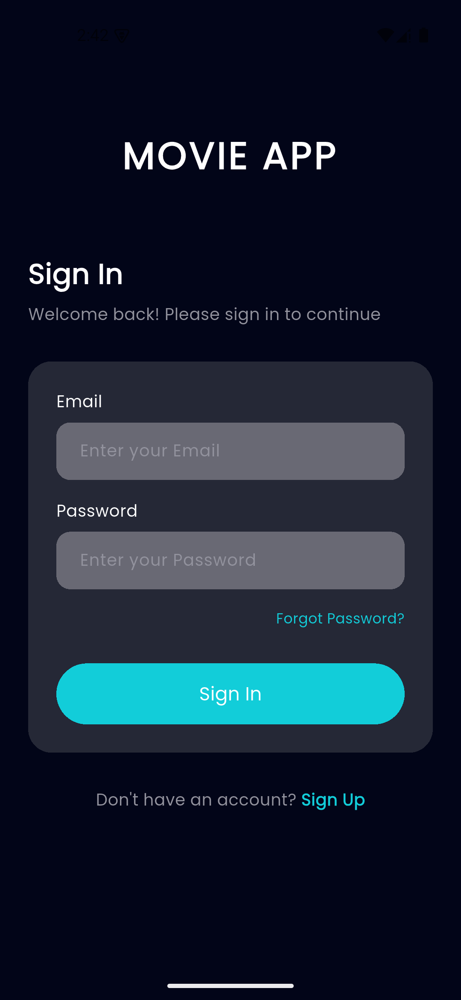
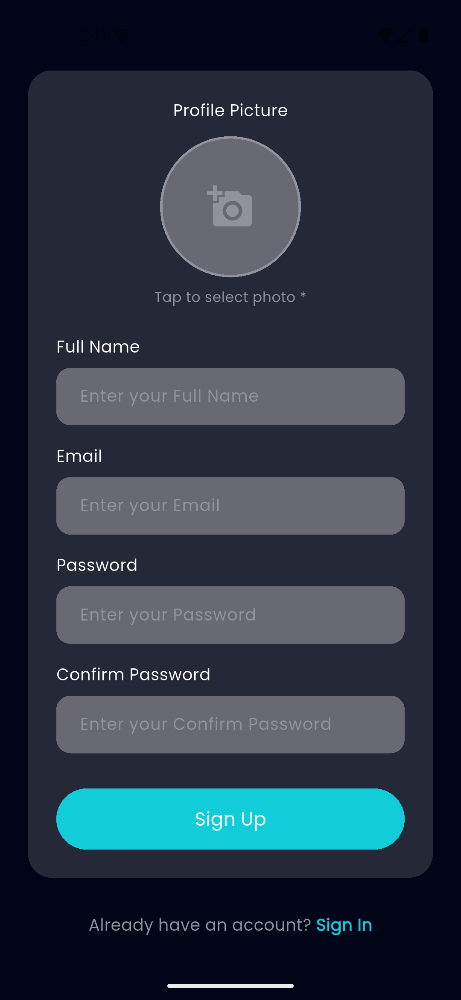
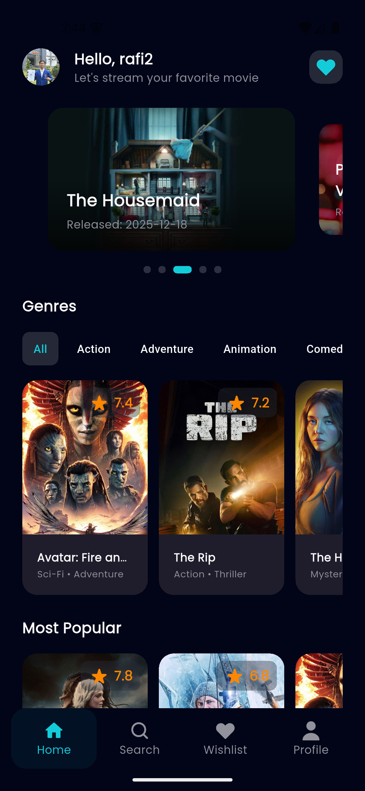
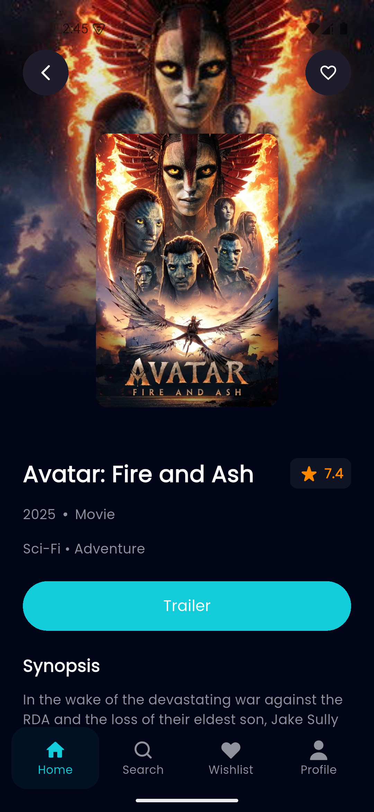
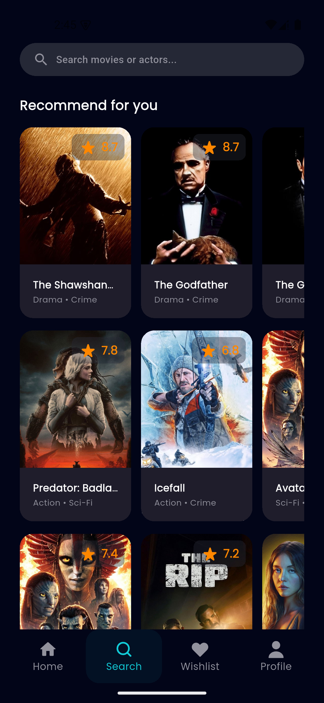
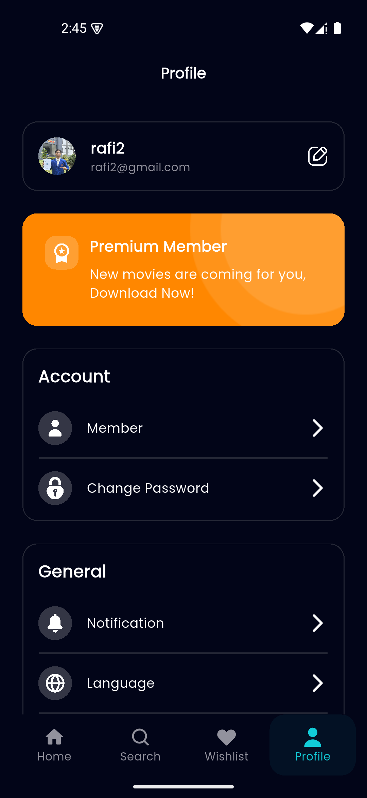
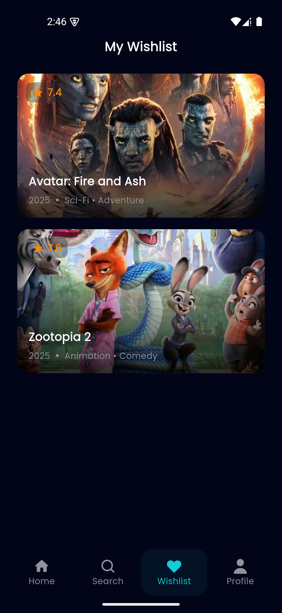
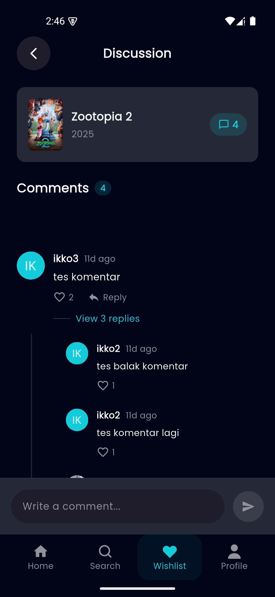
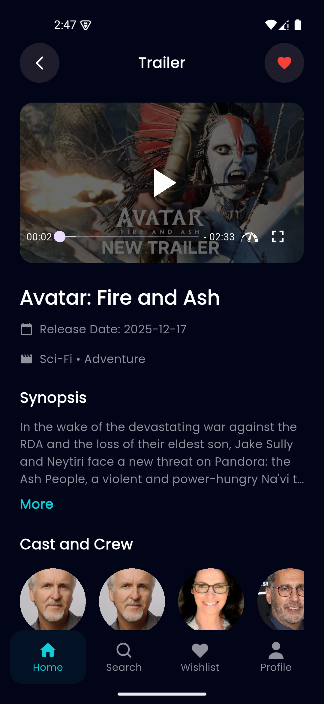

# 🎬 Movie App - Flutter Movie Discovery Platform

<div align="center">


**A modern, feature-rich movie discovery application built with Flutter and Supabase**

[Features](#-features) • [Screenshots](#-screenshots) • [Tech Stack](#-tech-stack) • [Installation](#-installation)

</div>

---

## 📱 About The Project

Movie App adalah aplikasi mobile cross-platform yang memungkinkan pengguna untuk:

- 🔍 Mencari dan menemukan film terbaru, populer, dan top rated
- 📖 Membaca detail lengkap film termasuk sinopsis, rating, cast & crew
- ❤️ Menyimpan film favorit dengan sinkronisasi cloud
- 💬 Menulis dan membaca review/komentar dari pengguna lain
- 🎥 Menonton trailer film langsung di aplikasi
- 👤 Mengelola profil dengan upload foto profil ke cloud storage

Aplikasi ini dibangun dengan arsitektur clean code, state management yang efisien, dan optimasi production-ready.

---

## ✨ Features

### 🎯 Core Features

- **🔐 Authentication & User Management**

  - Email/Password authentication dengan Supabase Auth
  - Auto-create user profile di database
  - Upload & update profile photo ke Supabase Storage
  - Session management dengan automatic token refresh

- **🎬 Movie Discovery**

  - Now Playing, Popular, Top Rated, Upcoming movies
  - Search movies dengan real-time results
  - Filter by genres
  - Infinite scroll pagination

- **📽️ Movie Details**

  - Complete movie information (title, overview, rating, release date)
  - Cast & Crew information dengan photos
  - Similar movies recommendations
  - YouTube trailer integration

- **❤️ Favorites System**

  - Add/remove favorites dengan **Optimistic UI Updates**
  - Cloud sync menggunakan Supabase
  - Offline-first approach dengan local caching
  - Instant feedback tanpa loading spinner

- **💬 Comments & Reviews**

  - Nested comments (parent + replies)
  - Like/unlike comments
  - Edit & delete own comments
  - Real-time updates dengan optimistic UI
  - User profile integration (avatar, username)

- **🖼️ Image Optimization**
  - CachedNetworkImage untuk automatic caching
  - Placeholder & error widgets
  - Optimized memory usage

### 🚀 Production Optimizations

- **✅ Zero Debug Logs** - kDebugMode check untuk production
- **✅ Optimized Queries** - Specific field selection, pagination limits
- **✅ Centralized Logging** - LoggerService untuk consistent logging
- **✅ Optimistic UI** - Instant feedback dengan rollback support
- **✅ Efficient State Management** - Provider pattern dengan O(1) lookups
- **✅ Image Caching** - CachedNetworkImage dengan disk persistence

---

## 📸 Screenshots

### 🔑 Authentication Flow

<!-- Ganti path di bawah dengan screenshots Anda -->

|              Login              |               Register                |
| :-----------------------------: | :-----------------------------------: |
|  |  |

### 🏠 Main Features

|           Home Page           |              Movie Detail               |              Search               |               Profile               |
| :---------------------------: | :-------------------------------------: | :-------------------------------: | :---------------------------------: |
|  |  |  |  |

---

### Favorites & Comments

|             Favorites List              |               Comments                |               Trailer               |
| :-------------------------------------: | :-----------------------------------: | :---------------------------------: |
|  |  |  |

---

## 🛠️ Tech Stack

### Frontend

- **Framework:** Flutter 3.8.1
- **Language:** Dart 3.0+
- **State Management:** Provider
- **UI Components:** Material Design 3
- **Image Handling:** CachedNetworkImage, Extended Image
- **Video Player:** YouTube Player Flutter
- **HTTP Client:** Dio

### Backend & Services

- **Backend as a Service:** Supabase
  - Authentication (Email/Password)
  - PostgreSQL Database
  - Storage (Avatar uploads)
  - Real-time subscriptions (optional)
- **Movie Data API:** The Movie Database (TMDB) API
- **Image CDN:** TMDB Image Service

### Architecture & Patterns

- **Architecture:** Clean Architecture with Repository Pattern
- **State Management:** Provider (with Optimistic Updates)
- **Logging:** Centralized LoggerService with kDebugMode
- **Caching:** In-memory cache + CachedNetworkImage

### Key Dependencies

```yaml
dependencies:
  # Core
  flutter_sdk: ^3.8.1

  # State Management
  provider: ^6.1.2

  # Backend & Database
  supabase_flutter: ^2.12.0

  # Networking
  dio: ^5.7.0
  http: ^1.5.0

  # UI & Design
  google_fonts: ^6.3.2
  flutter_svg: ^2.2.1
  carousel_slider: ^5.0.0
  cached_network_image: ^3.4.1
  extended_image: ^10.0.1
  smooth_page_indicator: ^1.2.1

  # Video
  youtube_player_flutter: ^9.0.4

  # Image Picker
  image_picker: ^1.1.2

  # Utils
  intl: ^0.20.2
  path_provider: ^2.1.5
```

---

## 🏗️ Architecture

### Folder Structure

```
lib/
├── app/
│   ├── bindings/          # Dependency injection setup
│   ├── controllers/       # Global controllers (theme, auth)
│   ├── core/
│   │   ├── config/        # API keys, constants, environment
│   │   ├── theme/         # App theme, colors, text styles
│   │   └── utils/         # Helper functions, LoggerService
│   ├── data/
│   │   ├── models/        # Data models (Movie, User, Comment)
│   │   ├── providers/     # API call logic (TMDB, Supabase)
│   │   ├── repositories/  # Data abstraction layer
│   │   └── services/      # Business logic services
│   ├── pages/             # UI screens
│   ├── routes/            # Navigation routes
│   └── widgets/           # Reusable UI components
├── main.dart              # App entry point
└── widgets/               # Global shared widgets
```

### Data Flow

```
UI (Pages)
    ↓
State Management (Provider)
    ↓
Repository (Data abstraction)
    ↓
Services/Providers (API calls)
    ↓
External APIs (TMDB, Supabase)
```

### Key Architectural Decisions

1. **Repository Pattern**: Abstraksi antara UI dan data source
2. **Optimistic Updates**: UI update dulu, sync server di background
3. **Centralized Logging**: Single LoggerService dengan production safety
4. **Provider State Management**: Simple, efficient, built-in Flutter solution

---

## 📥 Installation

### Prerequisites

- Flutter SDK 3.8.1 or higher
- Dart SDK 3.0 or higher
- Android Studio / VS Code with Flutter extensions
- Android device/emulator or iOS device/simulator

### 1. Clone Repository

```bash
git clone https://github.com/rafiikkodev/movie-app-flutter.git
cd movie-app
```

### 2. Install Dependencies

```bash
flutter pub get
```

### 3. Setup Environment Variables

Create `lib/app/core/config/env.dart`:

```dart
class Env {
  // TMDB API Configuration
  static const String tmdbApiKey = 'YOUR_TMDB_API_KEY';
  static const String tmdbBaseUrl = 'https://api.themoviedb.org/3';
  static const String tmdbImageBaseUrl = 'https://image.tmdb.org/t/p/w500';

  // Supabase Configuration
  static const String supabaseUrl = 'YOUR_SUPABASE_PROJECT_URL';
  static const String supabaseAnonKey = 'YOUR_SUPABASE_ANON_KEY';
}
```

### 4. Get TMDB API Key

1. Register di [The Movie Database (TMDB)](https://www.themoviedb.org/)
2. Go to Settings → API → Create API Key
3. Copy API Key dan paste ke `env.dart`

### 5. Setup Supabase Backend

#### A. Create Supabase Project

1. Register di [Supabase](https://supabase.com/)
2. Create new project
3. Copy Project URL dan Anon Key ke `env.dart`

#### B. Setup Database Tables

Jalankan SQL di Supabase SQL Editor:

```sql
-- Create profiles table
CREATE TABLE profiles (
  id UUID REFERENCES auth.users(id) PRIMARY KEY,
  username TEXT UNIQUE,
  full_name TEXT,
  email TEXT,
  avatar_url TEXT,
  created_at TIMESTAMPTZ DEFAULT NOW(),
  updated_at TIMESTAMPTZ DEFAULT NOW()
);

-- Create favorites table
CREATE TABLE favorites (
  id SERIAL PRIMARY KEY,
  user_id UUID REFERENCES auth.users(id) ON DELETE CASCADE,
  movie_id INTEGER NOT NULL,
  title TEXT,
  poster_path TEXT,
  vote_average REAL,
  release_date TEXT,
  genre_names TEXT,
  created_at TIMESTAMPTZ DEFAULT NOW(),
  UNIQUE(user_id, movie_id)
);

-- Create comments table
CREATE TABLE comments (
  id TEXT PRIMARY KEY DEFAULT gen_random_uuid()::text,
  movie_id INTEGER NOT NULL,
  user_id UUID REFERENCES auth.users(id) ON DELETE CASCADE,
  parent_id TEXT REFERENCES comments(id) ON DELETE CASCADE,
  content TEXT NOT NULL,
  likes_count INTEGER DEFAULT 0,
  created_at TIMESTAMPTZ DEFAULT NOW(),
  updated_at TIMESTAMPTZ DEFAULT NOW()
);

-- Create comment_likes table
CREATE TABLE comment_likes (
  id SERIAL PRIMARY KEY,
  comment_id TEXT REFERENCES comments(id) ON DELETE CASCADE,
  user_id UUID REFERENCES auth.users(id) ON DELETE CASCADE,
  created_at TIMESTAMPTZ DEFAULT NOW(),
  UNIQUE(comment_id, user_id)
);

-- Enable Row Level Security
ALTER TABLE profiles ENABLE ROW LEVEL SECURITY;
ALTER TABLE favorites ENABLE ROW LEVEL SECURITY;
ALTER TABLE comments ENABLE ROW LEVEL SECURITY;
ALTER TABLE comment_likes ENABLE ROW LEVEL SECURITY;

-- Create policies (allow authenticated users to read/write their own data)
-- Profiles policies
CREATE POLICY "Public profiles are viewable by everyone"
  ON profiles FOR SELECT USING (true);
CREATE POLICY "Users can insert their own profile"
  ON profiles FOR INSERT WITH CHECK (auth.uid() = id);
CREATE POLICY "Users can update own profile"
  ON profiles FOR UPDATE USING (auth.uid() = id);

-- Favorites policies
CREATE POLICY "Users can view their own favorites"
  ON favorites FOR SELECT USING (auth.uid() = user_id);
CREATE POLICY "Users can insert their own favorites"
  ON favorites FOR INSERT WITH CHECK (auth.uid() = user_id);
CREATE POLICY "Users can delete their own favorites"
  ON favorites FOR DELETE USING (auth.uid() = user_id);

-- Comments policies
CREATE POLICY "Comments are viewable by everyone"
  ON comments FOR SELECT USING (true);
CREATE POLICY "Authenticated users can insert comments"
  ON comments FOR INSERT WITH CHECK (auth.uid() = user_id);
CREATE POLICY "Users can update their own comments"
  ON comments FOR UPDATE USING (auth.uid() = user_id);
CREATE POLICY "Users can delete their own comments"
  ON comments FOR DELETE USING (auth.uid() = user_id);

-- Comment likes policies
CREATE POLICY "Comment likes are viewable by everyone"
  ON comment_likes FOR SELECT USING (true);
CREATE POLICY "Authenticated users can like comments"
  ON comment_likes FOR INSERT WITH CHECK (auth.uid() = user_id);
CREATE POLICY "Users can unlike comments"
  ON comment_likes FOR DELETE USING (auth.uid() = user_id);
```

#### C. Setup Storage for Avatars

1. Go to Supabase Storage
2. Create new bucket: `avatars`
3. Set bucket to **Public**
4. Create policy:

```sql
-- Allow authenticated users to upload avatars
CREATE POLICY "Avatar images are publicly accessible"
  ON storage.objects FOR SELECT USING (bucket_id = 'avatars');

CREATE POLICY "Authenticated users can upload avatars"
  ON storage.objects FOR INSERT
  WITH CHECK (bucket_id = 'avatars' AND auth.role() = 'authenticated');

CREATE POLICY "Users can update their own avatars"
  ON storage.objects FOR UPDATE
  USING (bucket_id = 'avatars' AND auth.uid()::text = (storage.foldername(name))[1]);

CREATE POLICY "Users can delete their own avatars"
  ON storage.objects FOR DELETE
  USING (bucket_id = 'avatars' AND auth.uid()::text = (storage.foldername(name))[1]);
```

### 6. Run The App

```bash
# Debug mode
flutter run

# Release mode (optimized, no logs)
flutter run --release

# Build APK
flutter build apk --release
```

---
